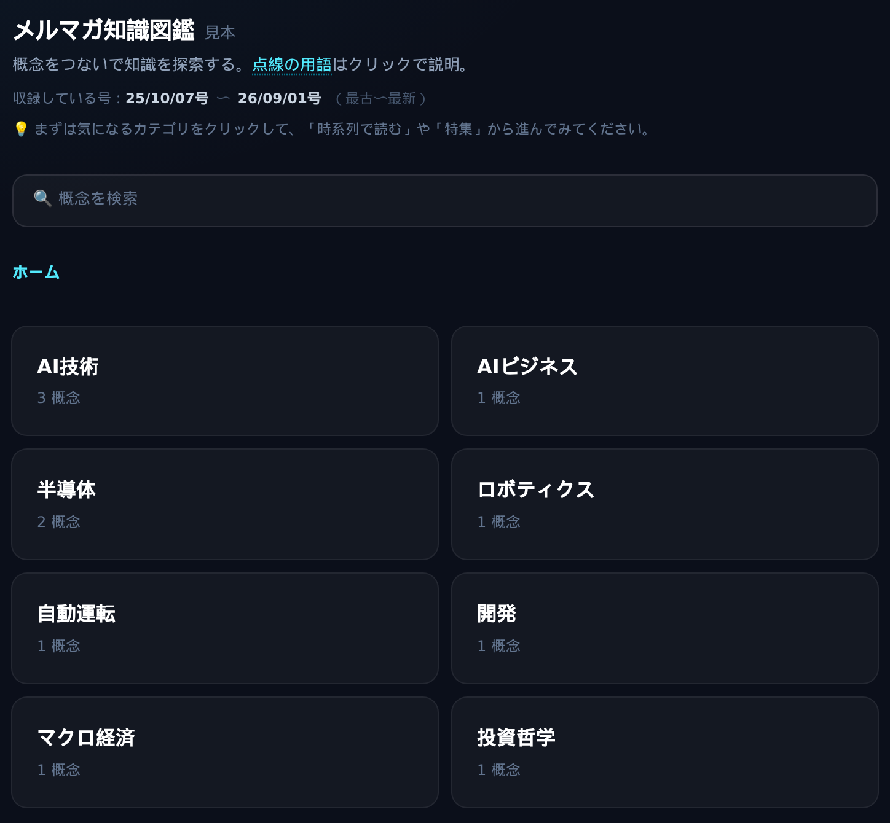
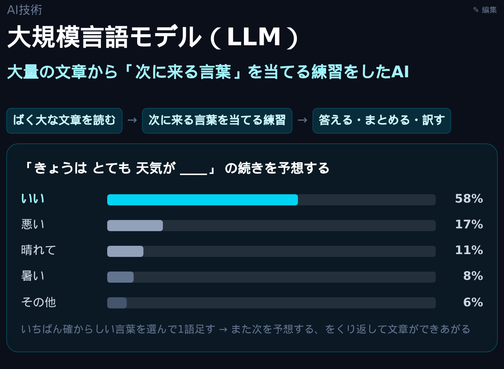
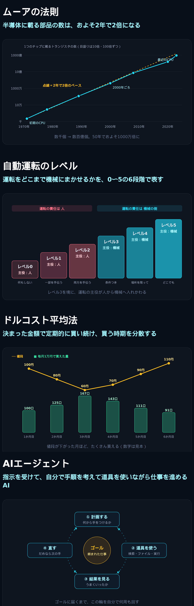
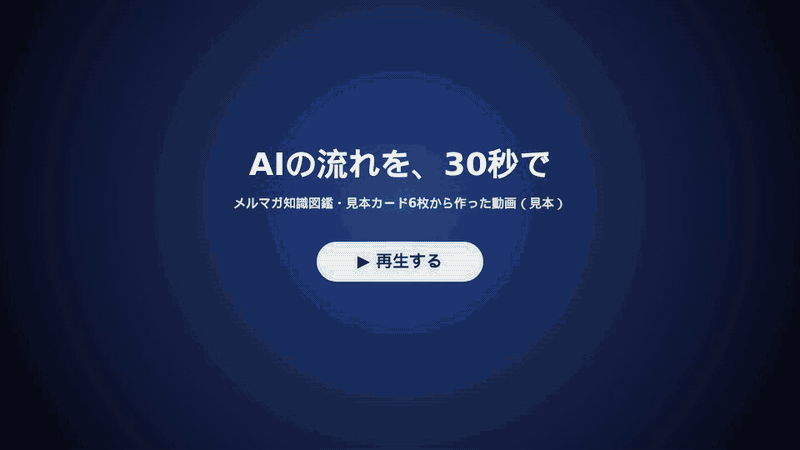

# メルマガ知識図鑑（MulmoClaude 用）

毎週届くメルマガを、**話題ごとのカード** に分けて積み上げていく図鑑です。
AIアシスタント [MulmoClaude](https://github.com/receptron/mulmoclaude) の上で動きます。



※画面は見本です。実際には、ここにメルマガのトピックが入ります。

## できること

- **1つの話題が、1枚のカードになる** — 同じ話題が何号にもわたって出てきても、カードは1枚にまとまります。
- **図解で、ひと目でつかめる** — カードごとに、AIが話題に合った図を描きます。
- **どの号の話かが、すぐ分かる** — カードの中の説明1つずつに、その話が出た号が付きます。
- **関連する概念へ、たどっていける** — カードの下に関係のある概念が並び、押すとそのカードへ移れます。
- **号の順に、読み返せる** — 「時系列で読む」で、カードを号の順にたどれます。
- **スマホでも読める**





※画面は見本です。実際には、ここにメルマガのトピックが入ります。

## カードを動画にできます



※見本カード6枚（GPU → ムーアの法則 → トランスフォーマー → 大規模言語モデル → トークン課金 → AIエージェント）だけで作った、約30秒の動画の見本です。この見本もキットに入っていて、図鑑の「AI技術」の分類から開けます。

カードがたまってきたら、MulmoClaude に「この分類を動画にして」と頼むと、カードをもとに動画を作ります。

- **案内役のキャラクター** が、話しながら絵を指さします
- **字幕と声** がつきます（声はブラウザの読み上げです）
- 下の **進捗バー** で、見たい場面へ飛べます
- 画面の言葉や絵を押すと、**用語の説明** が出ます

動画は1本ずつ、MulmoClaude が台本と絵を書きます。そのぶんトークンを多めに使います（目安：30秒で約5万〜20万、3分で約40万〜80万）。

## 中に入っているもの

```text
merumaga-zukan/
  SKILL.md            手順書（号の読み方と、カードへの分け方を MulmoClaude に伝えるもの）
  schema.json         カードの型（カードにどんな項目を持たせるか）
  views/map.html      パソコン用の画面（図鑑の見た目と図解の描き方）
  views/map-mobile.html  スマホ用の画面
  tools/mkmobile.cjs  パソコン用の画面からスマホ用を作り直す道具
  tools/add-video.cjs 動画を画面に埋め込む道具
  video/              動画の部品（再生の本体・絵の部品・見本の動画1本・点検の道具・作り方の手順書）
  samples/            見本のカード 11枚
```

入っているカードは見本だけです。ご自身のメルマガを取り込んだところから、あなたの図鑑が育ちはじめます。

## 使い方

1. MulmoClaude を用意する
2. このページの URL をコピーして MulmoClaude のチャットに貼り、「このメルマガ知識図鑑を入れて」と伝える
   （MulmoClaude がこのページから中身を取ってきて、図鑑を用意します。
   チャットには zip ファイルを貼れないので、URL を渡す形になります。）
3. 届いたメルマガの本文を貼り付けて「取り込んで」と伝える
4. 図鑑の画面を開くと、カードや図解、つながりができている

毎週これをくり返すと、カードが増え、つながりが足されて、図鑑が少しずつ育っていきます。
見本のカードが要らなくなったら、「見本を消して」と伝えるだけで片づきます。

## 知っておいてほしいこと

- これは **個人が作った非公式のしくみ** です。メルマガの筆者や運営とは関係ありません。
- 取り込むメルマガは、**ご自身で購読しているもの** を想定しています。
- 育てた図鑑は、ご自身の手元で楽しむためのものとして作っています。
- カードはAIがまとめたものなので、まちがいが入ることがあります。気になるところは原文で確かめると安心です。
- 見本カードの号の日付は、見せ方を伝えるための架空のものです。

## ライセンス

[MIT-0](LICENSE) です。このフォルダの中身（手順書・カードの型・画面・見本カード・動画の部品）は、作者名の表示なしで自由に使い、直し、組み込むことができます。
対象はこのフォルダの中身だけです。取り込んだメルマガの文章の扱いは、それぞれのメルマガの決まりに従います。
